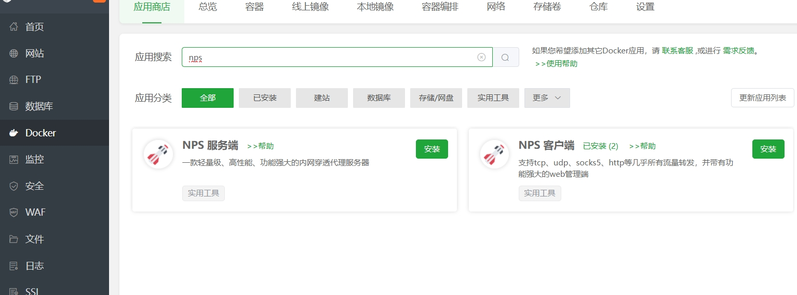
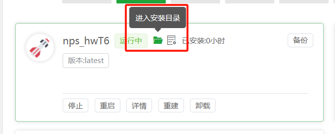
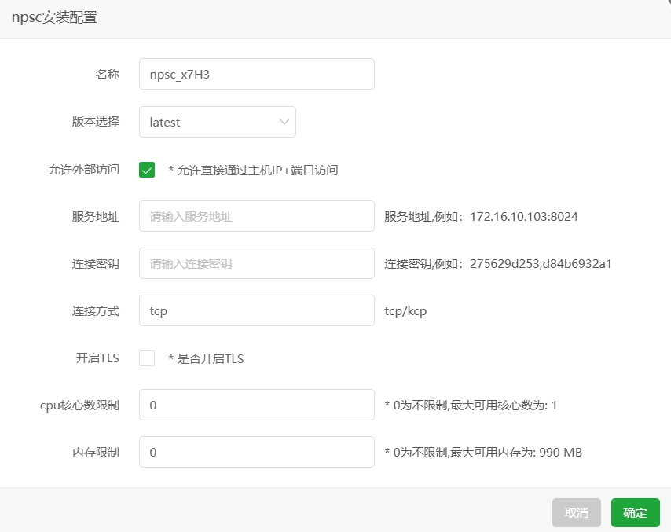

# 🐳 宝塔面板 (一键部署)

> 安装宝塔面板，前往宝塔面板官网，选择对应的脚本下载安装，推荐宝塔版本 9.2.0+

# 安装宝塔面板
1. 安装宝塔面板，前往 [宝塔面板官网](https://www.bt.cn/new/download.html) 进行安装，选择正式版脚本安装。

2. 登录面板，点击左侧 **Docker** 进入 `Docker 管理`。

3. 如提示未安装 Docker / Docker Compose， 可根据上方引导安装。

# 安装NPS服务端
1. 在宝塔面板左侧` Docker 菜单`，进入 **应用商城**，搜索 `NPS`，找到 `NPS 服务端` 并点击 **安装**。

2. 配置NPS，进入安装目录，修改 `conf/nps.conf` 即可（修改后记得重启容器），服务端参数配置详见 [配置文件说明](https://ehang-io.github.io/nps/#/server_config)
   

**注意**：NPS 默认的`WEB端口`为`80，443`, 如果端口被占用，请修改 `nps.conf` 中的 `http_proxy_port`，`https_proxy_port` 为其他端口。
web管理端口默认为`8081`，服务端启动后，输入：`ip:8081` 即可访问。

# 安装NPS客户端
1. 在宝塔面板左侧` Docker 菜单`，进入 **应用商城**，搜索 `NPS`，找到 `NPS 客户端` 并点击 **安装**。

2. 客户端配置有两种方式，1. [无配置文件模式](https://ehang-io.github.io/nps/#/use?id=%e6%97%a0%e9%85%8d%e7%bd%ae%e6%96%87%e4%bb%b6%e6%a8%a1%e5%bc%8f)（推荐），2. [配置文件模式](https://ehang-io.github.io/nps/#/use?id=%e9%85%8d%e7%bd%ae%e6%96%87%e4%bb%b6%e6%a8%a1%e5%bc%8f)。

- **无配置文件模式**：点击安装后，输入`服务地址`、`连接密钥`，即可启动客户端。`连接方式`和`开启TLS`参数，为了避免意外错误，不建议修改。如果需要配置多个客户端，直接安装多个即可（注意名字不要重复）。
 
- **配置文件模式**： `服务地址`、`连接密钥`不需要填写，直接点击 **安装** ，然后在`安装目录`下找到 `conf/npc.conf`，修改配置文件，再重启容器即可。客户端参数配置详见 [配置文件说明](https://ehang-io.github.io/nps/#/use?id=%e9%85%8d%e7%bd%ae%e6%96%87%e4%bb%b6%e6%a8%a1%e5%bc%8f)。

**注意**：强烈推荐使用无配置文件模式，所有数据应该在服务端保存和配置，而客户端只做连接转发。客户端配置文件对小白极不友好，配置繁琐，容易出错。

